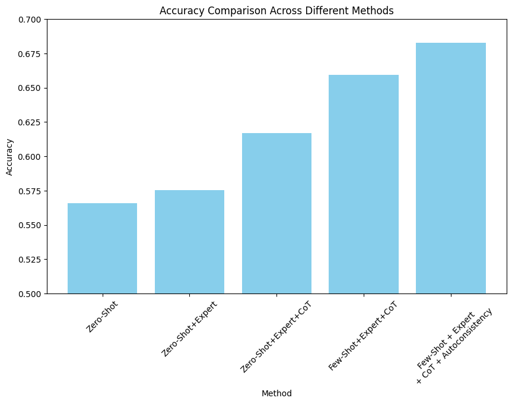

# GPT as a Zero/Few shot classifier

Created: 6 de noviembre de 2023 12:38
Created by: Jordi Vitrià

# GPT as Sentiment Analysis Classifier

Sentiment analysis is the process of determining the emotional tone behind a body of text. This is a common task in the fields of data analysis, customer feedback, and social media monitoring, where understanding public opinion or consumer sentiment is valuable. LLMs like GPT are trained on vast amounts of text data, which enables them to “understand” and generate human-like text. We will try out different kinds of prompting to carry out this task.

To test the capabilities of GPT in the sentiment classification task, we used the following data set, which contains reviews of hotels Trip Advisor. It contains reviews of hotels and the rating given from 1-5, and considered the following classification:

- Rating 1-2 → “negative”
- Rating 3 → “neutral”
- Rating 4-5 → “positive”

[https://www.kaggle.com/datasets/andrewmvd/trip-advisor-hotel-reviews](https://www.kaggle.com/datasets/andrewmvd/trip-advisor-hotel-reviews)

The notebooks with the experiments and instructions on how to run a streamlit demo can bge found in the following github repository:

[https://github.com/arturofredes/LLMEvaluationProject](https://github.com/arturofredes/LLMEvaluationProject)

# Comparing prompting techniques

LLMs are neural networks with a transformer architecture trained to do autoregression (predicting the next word after a sequence). They are trained over a large corpus of texts that include the Wikipedia, Internet scrapping, news articles, code and other sources. Furthermore, they are instruction-tuned in a second learning phase to output satisfactory responses to human instructions. Due to this nature, we can skillfully craft prompts or inputs to bias the behavior of AI models, particularly language models like GPT-4. This is called prompt engineering. The goal is to optimize the AI's response for accuracy, creativity, or specific outcomes.

In the following section, we will try different prompting techniques to try and optimize our classifier. We used test data set which contained 100 examples of each class and used GPT 3.5 turbo for the experiments

## Comparison and Results

The different techniques used were Zero-Shot Learning, Few-Shot Learning, ‘Chain of thought’ (CoT), definig the role as ‘Expert’ and Autoconsistency, we will explain them in more detail later on. In the following images, we can see how accuracy and F1 score of each of the classes improves when giving a better prompt.




## Zero-Shot Learning

In zero-shot learning, the model is asked to perform a task that it has not explicitly been trained on. It does this based on the knowledge it has already acquired during its initial training. In this case, we are asking GPT-3.5, which was trained on a wide range of texts, to classify the sentiment of a sentence without it having ever been specifically trained on sentiment analysis. The model uses its general understanding of language to infer the sentiment.

- **Prompt**
    
    **Role:** system
    
    **Content:** You are a helpful assistant who has to label reviews as 'positive', 'neutral' or 'negative’. Classify the review and give a confidence level on the prediction from (low, medium, high) as follows:
    Class: <class>
    Confidence Level: <confidence_level>
    
    **Role:**  user
    
    **Content:** review
    
- **Example**
    
    ```python
    #Example
    review = """'shame hotel wasnt good restaurant, arrived clift late afternoon struggle luggage 3 bags, 
    reception staff unhelpful uninterested, eventually managed sorted shown room 9th floor, 
    room suite tried make separate living room putting curtain inbetween bedroom living room, bathroom tiny dirty, 
    stayed mum unfortunatley night didnt feel suffering bad foot, decided phone reception ask doctor come hotel told 
    ther wasnt local receptionist closest told phone, eventually decided hospital just safe, 
    came hospital evening doormen talking girls outside let, following night ate hotel restaurant aisa cuba fantastic, 
    think hotel intrest restaurant bar, end day sleeping ignored wouldnt stay,'"""
    
    print(prompting(review, iterations = 1, shots = 'zero',  model='gpt-3.5-turbo', explanation=False, confidence = True, role = 'helpful assistant' ,client=client )[0])
    ```
    
    *Class: negative
    Confidence Level: high*
    

### Results

I we look at the results, we see that there clearly is a correlation between confidence and missclassification, although the model very rarely gives predictions with low confidence.

- **Classification Report**
    
    
    


## **Zero Shot + Expert**

By default, GPT acts as a 'helpful assistant'. We can bias the responses of the model by defining its role as being an expert in the field of the particular task we want it to perform. In this case, we will tell him that it is a 'expert hotelier'. We can see that perormance slightly improves.

- **Prompt**
    
    **Role:** system
    
    **Content:** You are an expert hotelier who has to label reviews as 'positive', 'neutral' or 'negative’. Classify the review and give a confidence level on the prediction from (low, medium, high) as follows:
    Class: <class>
    Confidence Level: <confidence_level>
    
    **Role:**  user
    
    **Content:** review
    
- **Example**
    
    ```python
    #Example
    review = """'shame hotel wasnt good restaurant, arrived clift late afternoon struggle luggage 3 bags, 
    reception staff unhelpful uninterested, eventually managed sorted shown room 9th floor, 
    room suite tried make separate living room putting curtain inbetween bedroom living room, bathroom tiny dirty, 
    stayed mum unfortunatley night didnt feel suffering bad foot, decided phone reception ask doctor come hotel told 
    ther wasnt local receptionist closest told phone, eventually decided hospital just safe, 
    came hospital evening doormen talking girls outside let, following night ate hotel restaurant aisa cuba fantastic, 
    think hotel intrest restaurant bar, end day sleeping ignored wouldnt stay,'"""
    
    print(prompting(review, iterations = 1, shots = 'zero',  model='gpt-3.5-turbo', explanation=False, confidence = True, role = 'expert hotelier' ,client=client )[0])
    ```
    
    *Class: negative
    Confidence Level: medium*
    

### Results

We can see some improvement over the last prompt in accuracy and in the f1 score of the negative class. There still is a correlation between missclassification and confidence, but giving the model an expert role eliminates low confidence predictions.

- **Classification Report**
    
    
    


## **Zero Shot + Expert + CoT**

The following technique we added is "Chain of Thought" (CoT). CoT consist in asking the model to perform the task step by step and "reason" all the way to the final result. In our case, the model will give reasons on why the review is positive or negative, biasing the final classification, since as we said, LLMs predict the next work given the previous input.

A secondary benefit from this approach is that providing reasoning behind classifications can increase transparency and build trust. When users understand why a model classifies a text in a certain way, they are more likely to trust and accept its conclusions, especially in cases where the sentiment analysis might not be straightforward.

**Limitations and Considerations**:
It's important to note that the "reasoning" provided by an LLM is an approximation based on patterns the model has learned during training. The model doesn't "understand" in the human sense but rather generates plausible explanations based on its training data. The explanations generated by an LLM might not always accurately reflect the true reasoning behind its classification. They should be understood as best guesses based on the model's training, not as definitive insights into the model's thought process.

- **Prompt**
    
    **Role:** system
    
    **Content:** You are an expert hotelier who has to label reviews as 'positive', 'neutral' or 'negative’. Explain the reasoning behind the classification step by step briefly and classify the review giving a confidence level on the prediction from (low, medium, high) as follows:
    
    Reasoning: <reasoning>
    Class: <class>
    Confidence Level: <confidence_level>
    
    **Role:**  user
    
    **Content:** review
    
- **Example**
    
    ```python
    #Example
    review = """'shame hotel wasnt good restaurant, arrived clift late afternoon struggle luggage 3 bags, 
    reception staff unhelpful uninterested, eventually managed sorted shown room 9th floor, 
    room suite tried make separate living room putting curtain inbetween bedroom living room, bathroom tiny dirty, 
    stayed mum unfortunatley night didnt feel suffering bad foot, decided phone reception ask doctor come hotel told 
    ther wasnt local receptionist closest told phone, eventually decided hospital just safe, 
    came hospital evening doormen talking girls outside let, following night ate hotel restaurant aisa cuba fantastic, 
    think hotel intrest restaurant bar, end day sleeping ignored wouldnt stay,'"""
    
    print(prompting(review, iterations = 1, shots = 'zero',  model='gpt-3.5-turbo', explanation=True, confidence = True, role = 'expert hotelier' ,client=client )[0])
    ```
    
    *Reasoning: The review mentions several negative aspects of the hotel, such as unhelpful staff, dirty room and bathroom, and a lack of concern for guest's well-being. However, the review also mentions a positive experience at the hotel restaurant.*
    
    *Class: Negative*
    
    *Confidence Level: Medium*
    

### Results

By using CoT we can see an improvement in f1 scores of all classes, as well as an improvement in accuracy. F1 score improves a 14% in the neutral class which is the most difficult to predict. We can still see a correlation between missclassification and confidence and the low confidence prediction reappear.

- **Classification Report**
    
    
    


## Few-Shot Classifier + Expert + CoT

Few-shot learning involves giving the model a small number of examples (or "shots") of the task at hand, from which it can quickly learn and adapt. We will give GPT three examples of text along with their sentiment classifications, in hopes of getting better outputs. The model then uses these examples to better understand and perform the sentiment analysis task. This approach can improve the model's accuracy on specific tasks without requiring extensive retraining.

- **Prompt**
    
    **Role:** system
    
    **Content:** You are an expert hotelier who has to label reviews as 'positive', 'neutral' or 'negative’. Explain the reasoning behind the classification step by step briefly and classify the review giving a confidence level on the prediction from (low, medium, high) as follows:
    
    Reasoning: <reasoning>
    Class: <class>
    Confidence Level: <confidence_level>
    
    **Role:**  user
    
    **Content: ‘** excellent stayed hotel monaco past w/e delight, reception staff friendly professional room smart comfortable bed, particularly liked reception small dog received staff guests spoke loved, mild negative distance uphill ppmarket restaurants 1st, overall great experience,  '
    
    **Role:**  assistant
    
    **Content:** 
    
    Reasoning: The reviewer highlights several positive aspects of their stay at Hotel Monaco. They mention that the reception staff was friendly and professional, and they enjoyed the smart and comfortable room with a comfortable bed. The reviewer also mentions that they particularly liked the fact that the reception staff was friendly towards a small dog and that the staff and guests spoke and loved the dog. Although there is a mild negative aspect mentioned, which is the distance uphill to the local market and restaurants, the overall tone of the review remains positive. The reviewer states that they had a great experience at the hotel, indicating that the positive elements outweigh the negative one.
    Class: positive
    
    Confidence Level: high
    
    **Role:**  user
    
    **Content:** "bad choice, booked hotel hot wire called immediately requesting nonsmoking room king bed room away elevator/ice.
    the person spoke pleasant stated not guarantee requests honored make note reservation, check-in person desk rude said no special
    request noted reservation card andstated no king beds way reservation stuck 2 double beds, located directly accross elevator ice,
    nonsmoking, no elevator parking garage hotel, warwick mats garage filthy stairwells, hotel faces 4th smells urine, carpets registration elevator area need cleaning,
    upholstery curtains room needed cleaning andpressing sign bathroom water conservation tub facet dripped continuously, tub drain needsattention shower curtain holes,
    no coffee maker room, bedding did not fit bed sleeping directly mattress bedding askew, staff unfriendly short,
    housekeeping staff quite pleasant, stay hotel, "
    
    **Role:**  assistant
    
    **Content:** 
    
    Reasoning: The review highlights several negative aspects of the hotel experience.
    The customer encountered issues with their booking request for a nonsmoking room with a king bed away from the elevator and ice.
    The front desk staff was rude and did not honor the special requests noted on the reservation card. They were given a room with two double beds located directly across from the elevator and ice machine.
    The hotel parking garage was dirty, and there was a smell of urine in the hotel lobby. The carpets in the registration and elevator area were dirty,
    and the upholstery and curtains in the room were also in need of cleaning. The bathroom had issues with water conservation, with the tub facet constantly dripping and the shower curtain having holes.
    There was no coffee maker in the room, and the bedding did not fit the bed properly. The staff, except for the housekeeping staff, were described as unfriendly and short.
    Overall, the review indicates a negative experience at the hotel.
    Class: negative
    
    Confidence Level: high
    
    **Role:**  user
    
    **Content:** "expensive, not biz travellers, simple fact hotel location simply unbeatable.. 
        mere stone throw away pike market, plenty great restaurants generally fun area, tourist, quality hotel so-so, 
        not place business travellers, bit hard especially just returned trip hk stayed conrad hk wynn macau, 
        compared inn feels like motel 6. issues:1. no desks rooms place laptops, wireless internet no place work bed,
          2. furniture coverings worned just outdated, 3. ac standalone unit attached wall, not central, 
        standalone unit quite bit noise, looks cheap tacky"
    
    **Role:**  assistant
    
    **Content:** 
    
    Reasoning:  the review contains both positive and negative elements.
    On one hand, it highlights the excellent location of the hotel, mentioning its proximity to Pike Market and great restaurants.
    On the other hand, it criticizes the quality of the hotel, comparing it unfavorably to others and pointing out several issues.
    This mix of positive and negative aspects can lead to a neutral overall sentiment.
    The language used in the review is relatively moderate. It doesn't use strong positive words (like "amazing" or "fantastic") or strongly negative words (like "horrible" or "terrible"). The reviewer states facts and observations without strong emotional emphasis.
    
    The reviewer lists specific issues (like no desks in rooms, worn furniture coverings, and the type of air conditioning) but does so in a factual manner without exaggeration.
    Class: neutral
    
    Confidence Level: medium
    
    **Role:**  user
    
    **Content:** review
    
    ```
    Reasoning: the review contains both positive and negative elements. 
            On one hand, it highlights the excellent location of the hotel, mentioning its proximity to Pike Market and great restaurants. 
            On the other hand, it criticizes the quality of the hotel, comparing it unfavorably to others and pointing out several issues. 
            This mix of positive and negative aspects can lead to a neutral overall sentiment.
            The language used in the review is relatively moderate. It doesn't use strong positive words (like "amazing" or "fantastic") or strongly negative words (like "horrible" or "terrible"). The reviewer states facts and observations without strong emotional emphasis.  
            The reviewer lists specific issues (like no desks in rooms, worn furniture coverings, and the type of air conditioning) but does so in a factual manner without exaggeration.
            \nClass: neutral
    ```
    
    ```python
    
            positive_explanation = """Reasoning: The reviewer highlights several positive aspects of their stay at Hotel Monaco. 
            They mention that the reception staff was friendly and professional, and they enjoyed the smart and comfortable room with a comfortable bed. 
            The reviewer also mentions that they particularly liked the fact that the reception staff was friendly towards a small dog and that the staff and 
            guests spoke and loved the dog. Although there is a mild negative aspect mentioned, which is the distance uphill to the local market and restaurants, 
            the overall tone of the review remains positive. The reviewer states that they had a great experience at the hotel, indicating that the positive elements outweigh the negative one.
            \n Class: positive""" + conf_pos
    
            negative_explanation = """"'Reasoning: The review highlights several negative aspects of the hotel experience.
            The customer encountered issues with their booking request for a nonsmoking room with a king bed away from the elevator and ice. 
            The front desk staff was rude and did not honor the special requests noted on the reservation card. They were given a room with two double beds located directly across from the elevator and ice machine. 
            The hotel parking garage was dirty, and there was a smell of urine in the hotel lobby. The carpets in the registration and elevator area were dirty, 
            and the upholstery and curtains in the room were also in need of cleaning. The bathroom had issues with water conservation, with the tub facet constantly dripping and the shower curtain having holes. 
            There was no coffee maker in the room, and the bedding did not fit the bed properly. The staff, except for the housekeeping staff, were described as unfriendly and short. 
            Overall, the review indicates a negative experience at the hotel.
            \n Class: negative'
            """ + conf_neg
            neutral_explanation = """"Reasoning: the review contains both positive and negative elements. 
            On one hand, it highlights the excellent location of the hotel, mentioning its proximity to Pike Market and great restaurants. 
            On the other hand, it criticizes the quality of the hotel, comparing it unfavorably to others and pointing out several issues. 
            This mix of positive and negative aspects can lead to a neutral overall sentiment.
            The language used in the review is relatively moderate. It doesn't use strong positive words (like "amazing" or "fantastic") or strongly negative words (like "horrible" or "terrible"). The reviewer states facts and observations without strong emotional emphasis.  
            The reviewer lists specific issues (like no desks in rooms, worn furniture coverings, and the type of air conditioning) but does so in a factual manner without exaggeration.
            \nClass: neutral
            """ + conf_nt
        else:
            if confidence == True:
                instruction = """Classify the review and give a confidence level on the prediction from (low, medium, high) as follows:
                Class: <class>
                Confidence Level: <confidence_level>
                """
                conf_pos = '\n Confidence Level: high'
                conf_neg = '\n Confidence Level: high'
                conf_nt = '\n Confidence Level: medium'
            else:
                instruction = "Do it as follows: Class: <class>"
                conf_pos = ''
                conf_neg = ''
                conf_nt = ''
            positive_explanation = 'Class: positive' + conf_pos
            negative_explanation = 'Class: negative' + conf_neg
            neutral_explanation = 'Class: neutral' + conf_nt
    
        good_review="""excellent stayed hotel monaco past w/e delight, reception staff friendly professional room smart comfortable bed, 
        particularly liked reception small dog received staff guests spoke loved, 
        mild negative distance uphill ppmarket restaurants 1st, overall great experience,  '"""
    
        bad_review = """bad choice, booked hotel hot wire called immediately requesting nonsmoking room king bed room away elevator/ice.
        the person spoke pleasant stated not guarantee requests honored make note reservation, check-in person desk rude said no special 
        request noted reservation card andstated no king beds way reservation stuck 2 double beds, located directly accross elevator ice, 
        nonsmoking, no elevator parking garage hotel, warwick mats garage filthy stairwells, hotel faces 4th smells urine, carpets registration elevator area need cleaning, 
        upholstery curtains room needed cleaning andpressing sign bathroom water conservation tub facet dripped continuously, tub drain needsattention shower curtain holes, 
        no coffee maker room, bedding did not fit bed sleeping directly mattress bedding askew, staff unfriendly short, 
        housekeeping staff quite pleasant, stay hotel, """
    
        neutral_review="""expensive, not biz travellers, simple fact hotel location simply unbeatable.. 
        mere stone throw away pike market, plenty great restaurants generally fun area, tourist, quality hotel so-so, 
        not place business travellers, bit hard especially just returned trip hk stayed conrad hk wynn macau, 
        compared inn feels like motel 6. issues:1. no desks rooms place laptops, wireless internet no place work bed,
          2. furniture coverings worned just outdated, 3. ac standalone unit attached wall, not central, 
        standalone unit quite bit noise, looks cheap tacky"""
    
        chat_completion = client.chat.completions.create(
            messages=[
                {
                    "role": "system",
                    "content": "You are a" + role + " who has to label reviews as 'positive', 'neutral'  or 'negative'." + instruction,
                },
                
                {
                    "role": "user",
                    "content": good_review,
                },
    
                {
                    "role": "assistant",
                    "content": positive_explanation,
                },
    
                {
                    "role": "user",
                    "content": neutral_review,
                },
    
                {
                    "role": "assistant",
                    "content": neutral_explanation ,
                },    
                
                {
                    "role": "user",
                    "content": bad_review,
                },
                
                {
                    "role": "assistant",
                    "content": negative_explanation,
                },
    
                {
                    "role": "user",
                    "content": review,
                },
    ```
    
- **Example**
    
    ```python
    #Example
    review = """'shame hotel wasnt good restaurant, arrived clift late afternoon struggle luggage 3 bags, 
    reception staff unhelpful uninterested, eventually managed sorted shown room 9th floor, 
    room suite tried make separate living room putting curtain inbetween bedroom living room, bathroom tiny dirty, 
    stayed mum unfortunatley night didnt feel suffering bad foot, decided phone reception ask doctor come hotel told 
    ther wasnt local receptionist closest told phone, eventually decided hospital just safe, 
    came hospital evening doormen talking girls outside let, following night ate hotel restaurant aisa cuba fantastic, 
    think hotel intrest restaurant bar, end day sleeping ignored wouldnt stay,'"""
    
    print(prompting(review, iterations = 1, shots = 'few',  model='gpt-3.5-turbo', explanation=True, confidence = True, role = 'expert hotelier' ,client=client )[0])
    ```
    
    *Reasoning: The review presents a negative experience at the hotel. The reviewer mentions struggling with their luggage upon arrival and describes the reception staff as unhelpful and uninterested. They were eventually shown to a room on the 9th floor, where they found issues such as a small and dirty bathroom and a makeshift separation between the living room and bedroom. The reviewer also mentions experiencing a foot problem and attempting to seek medical assistance from the hotel, but receiving unhelpful responses. They ended up going to a hospital instead. However, the reviewer does mention the positive experience of dining at the hotel restaurant on one occasion.*
    
    *Class: negative*
    
    *Confidence Level: medium*
    

### Results

Again, we are able to improve in accuracy and in f1 scores. For this prompt, we can also see that the model becomes under-confident and medium confidence is the most common.

- **Classification Report**
    
    
    


## Few-Shot Classifier + Expert + CoT + Autoconsistency

We have mentioned that LLMs are probabilistic predictors of the next word. Therefore, there could be cases were probability of choosing one class or another are similar. A way to go around this problem is using autoconsistency. This method consists on repeating the request several times and keeping the most common answer. In our case, we did 3 iterations and got better results.

- **Example**
    
    ```python
    #Example
    review = """'shame hotel wasnt good restaurant, arrived clift late afternoon struggle luggage 3 bags, 
    reception staff unhelpful uninterested, eventually managed sorted shown room 9th floor, 
    room suite tried make separate living room putting curtain inbetween bedroom living room, bathroom tiny dirty, 
    stayed mum unfortunatley night didnt feel suffering bad foot, decided phone reception ask doctor come hotel told 
    ther wasnt local receptionist closest told phone, eventually decided hospital just safe, 
    came hospital evening doormen talking girls outside let, following night ate hotel restaurant aisa cuba fantastic, 
    think hotel intrest restaurant bar, end day sleeping ignored wouldnt stay,'"""
    result = prompting(review, iterations = 3, shots = 'few',  model='gpt-3.5-turbo', explanation=True, confidence = True, role = 'expert hotelier' ,client=client )
    print(result[0], '\n\n', result[1], '\n\n',result[2])= 'few',  model='gpt-3.5-turbo', explanation=True, confidence = True, role = 'expert hotelier' ,client=client )[2])
    ```
    
    *Reasoning: The review describes a negative experience at the hotel.
    The review mentions struggling with luggage upon arrival and unhelpful and uninterested reception staff.
    The room had issues, such as attempting to separate the living room with a curtain and a bathroom that was described as tiny and dirty.
    The reviewer also mentions a personal health issue and their disappointment with the hotel's lack of assistance in finding a doctor.
    The positive aspect mentioned is the fantastic experience at the hotel restaurant, but it is overshadowed by the negative experience at the hotel itself.*
    
    *Class: negative*
    
    *Confidence Level: high*
    
    *Reasoning: The review contains both positive and negative aspects.
    The reviewer mentions struggling with their luggage upon arrival and describes the reception staff as unhelpful and uninterested.
    They were eventually shown to a room on the 9th floor, which they tried to make into a separate living room using a curtain. The reviewer found the bathroom to be tiny and dirty.
    However, they had a positive experience dining at the hotel restaurant on the following night.
    Overall, the review indicates a negative experience with the hotel, primarily due to the unhelpful reception staff, dirty bathroom, and unimpressive room setup.*
    
    *Class: negative*
    
    *Confidence Level: medium*
    
    *Reasoning: The review describes a negative experience at the hotel, specifically mentioning issues with the reception staff, the room, and the bathroom.
    The reviewer struggled with their luggage and found the reception staff unhelpful and uninterested. The room they were shown had a makeshift separation with a curtain and the bathroom was described as tiny and dirty.
    The reviewer also encountered a health issue and tried to get assistance from the hotel, but the receptionist was unable to provide any local assistance.
    Eventually, the reviewer decided to go to the hospital for safety reasons.
    The review does mention one positive aspect, which is the quality of the hotel restaurant. However, based on the overall negative experience,
    it seems that the reviewer would not recommend staying at the hotel.*
    
    *Class: negative
    Confidence Level: medium*
    

### Results

Taking the most reapeated result gives us further improvement, specially i´n the neutral class, where predictions are more difficult.

- **Classification Report**
    
    
    


# Final Experiment

To get results over a larger data set and test GPT-4 we carried out a final experiment.

- **Data set:** 4000 reviews (balanced)
- **Prompt:** We used Few-Shot + Expert + CoT. We did not use Autoconsistency due to the time and resource costliness of the experiment.

## Results

As we can see, the accuracy obtained is similar to the one we obtained when using the same techniques and autoconsistency with GPT-3.5. Recall is similar over the three classes (over 0.75). Precision is good for the negative and positive classes (over 0.9), but is worse for the neutral class, which is the hardest to predict (0.45).

If we look at the confidence we can see that there is clearly a correlation between confidence and missclassification, but GPT-4 still does not use the ‘low confidence’ label. 

- **Classification Report**
    
    
    


